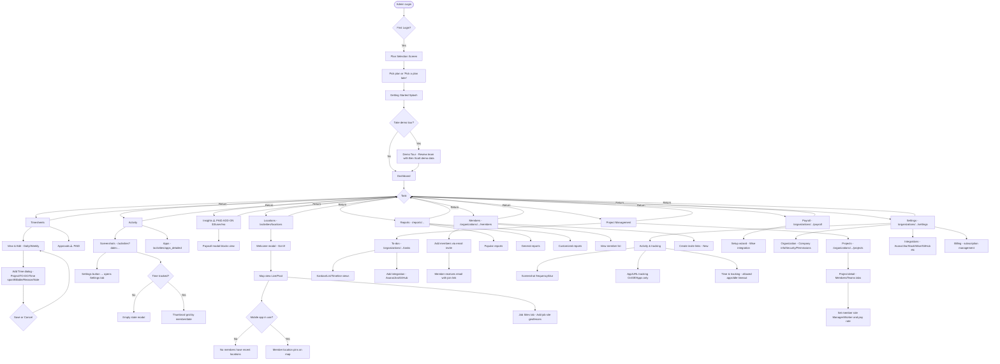
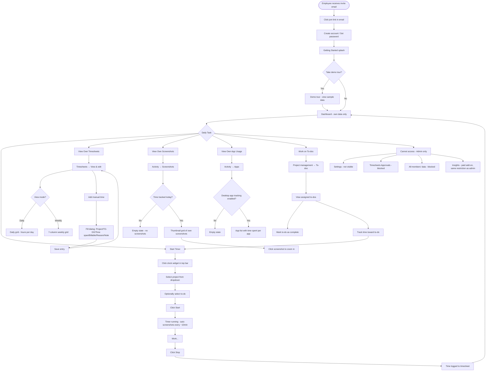

# Hubstaff Product Reference
## Complete UI Walkthrough — Admin & Employee Roles
**Date observed:** 2026-09-24  
**Org:** Vishnuvarthan's Organization (ID: 786971)  
**Plan:** 14-day free trial (no paid plan selected)  
**Account:** vishnu88varthan@gmail.com (Organization owner)

---

## Section 1 — Overview & Roles

### Roles in Hubstaff

Hubstaff has two primary roles visible in the UI:

| Attribute | Organization Owner / Admin | Employee (Member) |
|---|---|---|
| UI label | "Organization owner" | "Member" or role set per project |
| Can access Settings | Yes — full settings menu | No — not visible in sidebar |
| Can view all timesheets | Yes | Own timesheets only |
| Can add/remove members | Yes | No |
| Can approve timesheets | Yes (paid feature — Timesheets > Approvals) | Can only submit |
| Can see all screenshots | Yes | Own screenshots only |
| Can configure tracking | Yes | Cannot change org settings |
| Can set up payroll | Yes | Receives payments only |
| Can create projects | Yes | No (can log time to assigned projects) |
| Can view Insights | Paid add-on ($3/user/month) | Same restriction |
| Can view GPS/Locations | Yes (if mobile app used) | Own location only |
| Timer widget | Visible in top bar | Visible in top bar |

**Key constraint:** The free trial includes all core features but some are paywalled:
- **Timesheets Approvals** — requires paid plan (lightning bolt icon)
- **Insights** — Add-on at $3/user/month
- **Locations/GPS** — requires mobile app; map shows but needs mobile tracking
- **More Screenshots** — Add-on

---

## Section 2 — Employee Walkthrough (Real Screenshots — thalaivan.ugam@gmail.com)

> **Note:** This section was captured from a live employee session (thalaivan.ugam@gmail.com, user ID 4565099), invited to org 786971 and logged in via the invite link. All screenshots are real, not inferred.

### 2.1 Invite & Acceptance

The employee receives an email invite from Hubstaff. Clicking the invite link lands on the acceptance page.

**Screenshot 37** — Accept invite page  

Page title: "Welcome to Hubstaff!" Shows the organization name, admin name, and an "Accept Invitation" button. Employee must accept before accessing the org.

### 2.2 Onboarding — Step 1: Install & Track

After accepting, employees are guided through a 2-step onboarding flow.

**Screenshot 39** — Employee onboarding step 1  

Step 1 reads: "Install the desktop app and track time to a project." The sidebar at this stage is icon-only (collapsed) with very limited items visible — the employee sees minimal navigation until onboarding is complete.

If the employee cannot install the desktop app or it doesn't apply, they can click "Need help, can't track, or doesn't apply?"

**Screenshot 40** — Skip tracking dialog  

A modal appears with an FAQ and a "Continue without tracking time" button. This allows bypassing the desktop app requirement.

### 2.3 Onboarding — Step 2: Get Familiar

**Screenshot 41** — Onboarding step 2  

Step 2 shows a "Get familiar with Hubstaff" video and a "Complete onboarding" button. Once clicked, the employee lands on their Dashboard.

### 2.4 Employee Dashboard

**Screenshot 42** — Employee dashboard  

Key observations:
- **Sidebar is icon-only and collapsed** — no text labels, no Settings, no People/Members
- **Sidebar items visible:** Dashboard, Timesheets, Activity, Insights, Locations, Projects, Calendar, Reports, Teams, Client Invoices
- **Missing vs admin:** No Settings gear, no Members/People section, no Payroll/Financials, no Silent App entry

Dashboard widgets visible:
- **Weekly Activity** — chart, empty (no time tracked yet)
- **Worked This Week** — 0:00
- **Earned** — $0.00 (no hourly rate configured)
- **Projects Worked** — 0 projects this week
- **Recent Activity** — only the employee's own screenshots appear here
- **Timesheet** — table of own time entries

### 2.5 Timesheets

**Path:** Timesheets → View & edit  
**URL:** `/organizations/786971/time_entries`

**Screenshot 43** — Employee timesheets  

The view is pre-filtered to the logged-in employee ("thalaivan ugam") — they cannot switch to see other members. Available controls:
- Daily / Weekly / Calendar view toggle
- Date picker
- Timezone selector
- "Add time" button (can add manual time)

Today shows **0:00:00** since no time has been tracked.

### 2.6 Activity — Screenshots

**Path:** Activity → Screenshots  
**URL:** `/organizations/786971/activities`

**Screenshot 44** — Employee activity screenshots  

Empty state shows: "You have not tracked any time. Get Started." The employee sees only their own screenshots. Controls visible:
- "Every 10 min" / "All screenshots" toggle
- Date picker + user filter (own name only)

When time is tracked via desktop app, screenshots appear here in a timeline grid.

### 2.7 Insights (Paid — Employee Cannot Enable)

**Path:** Insights  
**URL:** `/organizations/786971/insights?tab=performance`

**Screenshot 45** — Insights paywall for employee  

Employees see the same Insights paywall as admins, but instead of a payment button, they see: **"Ask an organization owner to add this add-on."** The employee cannot purchase or enable Insights — only the owner can. Price: $3/user/month.

### 2.8 Locations / Map

**Path:** Locations  
**URL:** `/organizations/786971/activities/locations`

**Screenshot 46** — Locations intro  

**Screenshot 47** — Locations map empty state  

The Map page loads and shows: "No locations have been tracked for this day. Use one of our mobile apps to track time." GPS location tracking requires the Hubstaff mobile app (iOS or Android) with location permissions granted. The sidebar shows MEMBERS and JOB SITES tabs with "No members have recent locations."

### 2.9 Projects

**Path:** Projects  
**URL:** `/organizations/786971/projects`

**Screenshot 48** — Employee projects list  

The employee can **view** projects they're assigned to but cannot create new projects. The list shows:
- "Vishnuvarthan's Organization's Project" — Teams: None, To-dos: No to-dos, Budget: None

The "Actions" dropdown is visible (for marking to-dos, viewing details) but no "New project" button exists.

### 2.10 Calendar / Schedules

**Path:** Calendar  
**URL:** `/organizations/786971/schedules`

**Screenshot 49** — Employee schedules calendar  

The Schedules page shows a weekly calendar. The employee sees only themselves ("thalaivan ugam") in the members list. Currently no shifts are scheduled. The "Actions" button is visible but employees cannot create org-wide schedules (only admins assign shifts). Events available: Holidays, Shifts, Time off.

### 2.11 Reports

**Path:** Reports  
**URL:** `/reports/786971`

**Screenshot 50** — Employee reports  

Employees have access to the Reports section and see the same report templates as admins:
- **Time & activity** — own time, activity levels, and amounts earned per project
- **Amounts owed** — how much they're owed
- **Daily totals** — daily breakdown

A banner notes: "Scheduled reports are now found in customized reports." No custom reports exist yet.

### 2.12 Teams

**Path:** Teams  
**URL:** `/organizations/786971/teams`

**Screenshot 52** — Employee teams empty  

The Teams page is accessible but shows "No teams yet." Employees can view teams they belong to; creating teams is an admin function.

### 2.13 Invoices (User Invoices)

**Path:** Client Invoices  
**URL:** `/organizations/786971/client_invoices` → redirects to `/organizations/786971/team_invoices`

**Screenshot 54** — Employee user invoices  

The "Client Invoices" sidebar item routes employees to **User invoices** (their own invoice-sending feature, not org-level client invoicing). Shows:
- Outstanding: $0.00 / Paid: $0.00
- "New invoice" button — employees can generate invoices to send to clients
- 0 invoices currently

### 2.14 Employee Sidebar — Full Comparison

| Sidebar Item | Admin Sees | Employee Sees | Notes |
|---|---|---|---|
| Dashboard | ✅ Team-wide | ✅ Own data only | Admin has "ALL" tab; employee sees only own |
| Timesheets | ✅ All members | ✅ Own only | Filter locked to self |
| Activity / Screenshots | ✅ All members | ✅ Own only | |
| Activity / Apps | ✅ All members | ✅ Own only | |
| Insights | 🔒 Paid add-on | 🔒 "Ask owner" | Employee cannot purchase |
| Locations / Map | ✅ All members | ✅ Own only | Requires mobile app |
| Projects | ✅ Create + manage | 👁 View assigned only | No "New project" button |
| Calendar / Schedules | ✅ Create shifts | 👁 View own schedule | Cannot assign shifts |
| Reports | ✅ All members | ✅ Own data | Same templates, different scope |
| Teams | ✅ Create + manage | 👁 View only | No create button |
| Invoices | ✅ Client invoices (org) | ✅ User invoices (own) | Different page entirely |
| **People / Members** | ✅ Full member mgmt | ❌ Not visible | Not in sidebar at all |
| **Settings** | ✅ Full settings | ❌ Not visible | Not in sidebar at all |
| **Payroll / Financials** | ✅ Payroll, expenses | ❌ Not visible | Not in sidebar at all |
| **Silent App** | ✅ Available | ❌ Not visible | Admin-only feature |

---

## Section 3 — Admin / Owner Walkthrough (with Screenshots)

The admin (Organization owner) has full access to all sections. This walkthrough follows the complete admin journey.

### 3.1 Plan Selection (First Login)

**Screenshot 01** — Plan selection  

On first login, admins are shown paid plans:
| Plan | Price | Key features |
|---|---|---|
| Starter | $4.99/seat/mo | Time tracking, screenshots, activity |
| Grow | $7.50/seat/mo | + Timesheets, invoicing |
| Team | $10/seat/mo | + Scheduling, GPS, expense tracking |
| Enterprise | $25/seat/mo | + Compliance, SSO, custom reports |

Admins can select "Pick a plan later" to enter the 14-day trial.

### 3.2 Dashboard — Admin View

**Screenshot 05** — Main Dashboard  

Admin Dashboard shows:
- Team-wide metrics (ME tab shows own data, ALL tab shows all members)
- **Manage widgets** button to customize layout
- Trial banner (14-day countdown)
- Wise payroll integration banner
- RECENT ACTIVITY widget with team screenshots
- INSIGHTS widget (prompts upgrade)

### 3.3 Timesheets — Approvals (Paid Feature)

**Path:** Timesheets → Approvals

**Screenshot 06** — Timesheets Approvals permission denied  

The Approvals tab is locked behind a paid plan. Shows "Permission denied" on the free trial. The lightning bolt icon indicates paid-only features throughout the UI.

### 3.4 Timesheets — View & Edit

**Path:** Timesheets → View & edit

**Screenshot 07** — Daily view  

**Screenshot 08** — Weekly view  

Admins can see all team members' timesheets, filter by member/project/date, and add time entries for any member.

### 3.5 Activity — Screenshots

**Path:** Activity → Screenshots  
URL: `/organizations/786971/activities?date=2026-09-24&...`

**Screenshot 12** — Screenshots empty state  

Controls visible:
- Date picker
- "Every 10 min" vs "All screenshots" toggle
- Settings button (goes to screenshot settings)

### 3.6 Screenshot Settings

**Path:** Settings → Activity & tracking → Screenshots

**Screenshot 13** — Screenshot frequency settings  

**Screenshot 14** — Screenshot blur settings  

Admin can set:
- **Frequency:** 1x (default global setting), with per-member overrides
- **Blur:** Off or On per member (blurs screenshots before upload — employee privacy option)

### 3.7 Activity Tracking Settings

**Path:** Settings → Activity & tracking → Activity

**Screenshot 15** — Track apps & URLs settings  

Options:
- Off — no app/URL tracking
- Apps — track app names only
- Apps & URLs — track app names + page URLs

### 3.8 Activity — Apps

**Path:** Activity → Apps  
URL: `/organizations/786971/activities/apps_detailed`

**Screenshot 16** — Apps intro/splash  

**Screenshot 17** — Apps empty state  

Demo shows: Chrome 52%, Mail 20%, Slack 12%, Figma 11%, Photoshop 5%

### 3.9 Insights (Paid Add-On)

**Path:** Activity → Insights  
URL: `/organizations/786971/insights`

**Screenshot 18** — Insights paid add-on modal  

**Screenshot 19** — Insights modal with video  

**Screenshot 20** — Insights dashboard blurred  

Insights is a **separate paid add-on at $3/user/month**. Behind the paywall are widgets for: TIME WORKED, PRODUCTIVITY, ACTIVITY, TO-DOS COMPLETED, ACHIEVEMENTS.

### 3.10 Locations — GPS Tracking

**Path:** Locations → Map  
URL: `/organizations/786971/activities/locations`

**Screenshot 21** — Locations map welcome modal  

**Screenshot 22** — Locations empty state  

**Screenshot 23** — Locations map live view  

The Map page shows:
- **Live / Past** toggle
- World map with member location pins
- Right panel: MEMBERS tab (showing "No members have recent locations") + JOB SITES tab
- Updates every 60 seconds
- Search by country/state/city
- Timezone selector (IST)

**Screenshot 24** — Job Sites tab  

Job Sites panel shows:
- Visited / All job sites toggle
- Search job sites
- Sort: Last visited
- Manage job sites link
- **Add job site** button (creates geofenced zones)

> **Note:** Location tracking requires the **Hubstaff mobile app**. Web-only users do not generate location data. GPS is available on the free trial but requires mobile app installation by members.

### 3.11 Projects

**Path:** Project management → Projects  
URL: `/organizations/786971/projects?status=active`

**Screenshot 26** — Projects list  

**Screenshot 27** — Project detail  

A default project ("Vishnuvarthan's Organization's Project") is created automatically. Columns: Name, Teams, Members, To-dos, Budget, Member limits.

Project detail shows:
- **Client:** None (can be set)
- **Status:** Active (can archive)
- **Billable:** Yes/No toggle
- **Budget:** None / Edit budget
- **MEMBERS** tab — member list with Role (Manager/Worker) and Pay rate/Bill rate
- **TEAMS** tab — team assignments
- Actions: Edit, Duplicate, Transfer, Archive, Delete

### 3.12 To-dos

**Path:** Project management → To-dos  
URL: `/organizations/786971/tasks`

**Screenshot 28** — To-dos welcome  

**Screenshot 29** — To-dos Kanban  

Admins can:
- Create to-dos (Assignee, Mark as complete)
- Switch views: List, Kanban, Timeline
- Add integration (Hubstaff Tasks, Asana, Jira, etc.)
- Import from external tools via **Add integration**

### 3.13 Reports

**Path:** Reports  
URL: `/reports/786971`

**Screenshot 30** — Reports main page  

**Screenshot 31** — Reports popular list  

Report types available:
- **Popular:** Time & activity (NEW), Amounts owed, Daily totals
- **General:** Work sessions, Apps & URLs, Manual time edits
- **Payment:** (visible below scroll)
- **Budgets & limits:** Weekly limits, Project budgets, Client budgets
- Customized reports (schedulable, exportable)

### 3.14 Members

**Path:** People → Members (also accessible via sidebar)  
URL: `/organizations/786971/members`

**Screenshot 32** — Members list  

Tabs: MEMBERS (1), INVITES (0), INVITE LINKS (1 — New)

The member table shows: Status, Role, Projects, Payment, Limits, Time tracking status, Date added.

The current member (vishnuvarthan venkatapathy) shows:
- Status: Active
- Role: Organization owner
- Projects: 1
- Payment: No pay rate / No bill rate
- Limits: No weekly/daily limit
- Time tracking status: Enabled

Admin actions available: Export, Import members, Add members, Filters, Batch actions.

### 3.15 Payroll

**Path:** Financials → Payroll  
URL: `/organizations/786971/payroll`

**Screenshot 33** — Payroll intro  

Payroll is **included in the plan at no extra cost**. It converts tracked hours into payments. The intro page offers:
- Get started now
- Schedule a demo
- Remind me later

Supported payment integrations: Wise (prominently advertised), others.

### 3.16 Settings — Main Hub

**Path:** Settings  
URL: `/organizations/786971/settings`

**Screenshot 34** — Settings main  

Settings sections:

| Section | Sub-items |
|---|---|
| Organization | Company information, Security & log in, Projects & to-dos, Permissions |
| Members | Custom fields, Work time limits, Payments, Achievements |
| Schedules | Calendar, Job sites, Map |
| Activity & tracking | Activity, Timesheets, Time & tracking, Screenshots |
| Insights | Apps/URLs classifications (Add-on), Remote vs in-office (Add-on) |
| Policies | Time off, Work breaks, Overtime |
| Integrations | All integrations, Wise, Jira, Slack, Hubstaff MCP |
| Billing | Billing information, Subscription invoices, Subscription settings, Client invoice |

### 3.17 Settings — Time & Tracking

**Screenshot 35** — Time & tracking settings  

Sub-tabs: ACTIVITY | TIMESHEETS | TIME & TRACKING | SCREENSHOTS

Under Time & tracking:
- **Allowed apps:** All apps / Desktop only / Mobile only (global + per-member override)
- **Idle timeout** — auto-stop timer on inactivity
- **Keep idle time** — whether to retain time during idle periods
- **Automatic tracking policy** ⭐ — premium feature marker

### 3.18 Integrations

**Path:** Settings → Integrations  
URL: `/organizations/786971/integrations/new`

**Screenshot 36** — Integrations page  

Categories: AI tools, Project management, CRM, Payment processors, Payroll providers & accounting, HRIS, Help desk, Communication, Calendars, Dummy integrations.

Visible integrations: Asana, Breeze, GitHub, Insightly, and many others.

---

## Section 4 — Detailed Flow per Screen

### Screen: Dashboard (`/dashboard/786971/team`)

| Attribute | Detail |
|---|---|
| Entry | Any login, sidebar click on "Dashboard" |
| Exit | Any sidebar link, or timer start |
| Tabs | ME (own data), ALL (team data) |
| Widgets | Weekly Activity, Worked This Week, Spent This Week, Projects Worked, Recent Activity, Insights |
| Actions | Manage widgets, click widget to drill down |
| Role differences | Admin sees all members' data in ALL tab; Employee sees only own data |
| Banners | Trial countdown, Wise payroll CTA |
| Error states | None observed |

### Screen: Timesheets > View & Edit (`/organizations/786971/time_entries/weekly`)

| Attribute | Detail |
|---|---|
| Entry | Sidebar: Timesheets → View & edit |
| Exit | Any sidebar link |
| Tabs | Daily, Weekly |
| Actions | Add time (opens dialog), edit existing entries |
| Add time dialog fields | Project, TO-DO, Time span, Billable, Reason, Note |
| Role differences | Admin sees all members; Employee sees own only |
| Redirect behavior | Navigating to `/timesheets/786971` lands on Approvals (paid) — must explicitly click "View & edit" |

### Screen: Timesheets > Approvals (`/organizations/786971/timesheets`)

| Attribute | Detail |
|---|---|
| Entry | Sidebar: Timesheets → Approvals |
| Access | **Paid feature** — shows "Permission denied" on free trial |
| Purpose | Admin reviews and approves/rejects submitted timesheets |
| Role differences | Admin-only feature |
| Error states | "Permission denied" on free plan |

### Screen: Activity > Screenshots (`/organizations/786971/activities?...`)

| Attribute | Detail |
|---|---|
| Entry | Sidebar: Activity → Screenshots |
| URL note | NOT `/screenshots/786971` — that returns 404 |
| Controls | Date picker, Every 10 min / All screenshots toggle, Settings button |
| Settings button | Opens Settings in a new tab (tab 85737874 in this session) |
| Empty state | "Your team has not tracked any time" modal appears first time |
| Role differences | Admin sees all members; Employee sees own |

### Screen: Activity > Apps (`/organizations/786971/activities/apps_detailed`)

| Attribute | Detail |
|---|---|
| Entry | Sidebar: Activity → Apps |
| URL note | NOT `/activities/apps` — that returns 404. Correct: `/activities/apps_detailed` |
| Columns | Project, App name, Time spent, Sessions |
| Empty state | No data shown until desktop app tracks time |
| Role differences | Admin sees team; Employee sees own |

### Screen: Insights (`/organizations/786971/insights`)

| Attribute | Detail |
|---|---|
| Entry | Sidebar: Insights, or Favorites → Performance |
| Access | **Paid add-on** ($3/user/month) |
| Paywall behavior | Modal appears with video; dashboard visible but blurred |
| Closing modal | Escape key doesn't work; clicking outside doesn't work; must use JS to close |
| Widgets (behind paywall) | TIME WORKED, PRODUCTIVITY, ACTIVITY, TO-DOS COMPLETED, ACHIEVEMENTS |

### Screen: Locations > Map (`/organizations/786971/activities/locations`)

| Attribute | Detail |
|---|---|
| Entry | Sidebar: Locations → Map |
| URL note | NOT `/organizations/786971/locations` — that returns 404 |
| Welcome modal | "Map - The map will show the location of team members using the mobile app..." with Got it! button |
| Empty state modal | "No locations have been tracked for this day — Use one of our mobile apps" |
| Live map | World map with 60s auto-refresh, member pins, search by location |
| Tabs (right panel) | MEMBERS (no recent locations) / JOB SITES (no sites created) |
| Toggle | Live / Past |
| Requirement | Mobile app needed for actual tracking |

### Screen: Locations > Job Sites

| Attribute | Detail |
|---|---|
| Entry | Sidebar: Locations → Job sites, or right panel JOB SITES tab |
| Sub-tabs | Visited / All job sites |
| Controls | Search job sites, Sort: Last visited, Manage job sites, Add job site |
| Empty state | "No job sites created yet" with Add job site button |

### Screen: Projects (`/organizations/786971/projects?status=active`)

| Attribute | Detail |
|---|---|
| Entry | Sidebar: Project management → Projects, or Favorites → Projects |
| Tabs | ACTIVE (n), ARCHIVED (0) |
| Columns | Name, Teams, Members, To-dos, Budget, Member limits |
| Actions | Import projects, Add project, Batch actions, Actions dropdown per row |
| Default project | "Vishnuvarthan's Organization's Project" auto-created |
| Project detail URL | `/projects/{project_id}` (e.g. `/projects/4219615`) |
| Detail tabs | MEMBERS (role + pay rate) / TEAMS |
| Detail actions | Edit, Duplicate, Transfer, Archive, Delete |

### Screen: To-dos (`/organizations/786971/tasks`)

| Attribute | Detail |
|---|---|
| Entry | Sidebar: Project management → To-dos |
| Welcome modal | Feature intro shown first visit |
| Views | List, Kanban, Timeline |
| Filters | Project dropdown, Assignee, Show completed toggle, Search |
| Actions | +Add, Duplicate project, Add integration |
| Integration options | Hubstaff Tasks (external product), Asana, Jira, GitHub, etc. |

### Screen: Reports (`/reports/786971`)

| Attribute | Detail |
|---|---|
| Entry | Sidebar: Reports |
| Intro | Video guide banner ("Watch video") |
| Sections | Customized reports (empty), Popular reports, General, Payment, Budgets & limits |
| Popular reports | Time & activity (New), Amounts owed, Daily totals |
| General reports | Work sessions, Apps & URLs, Manual time edits |
| Customized | Can schedule and save custom report configs |

### Screen: Members (`/organizations/786971/members`)

| Attribute | Detail |
|---|---|
| Entry | Sidebar: People → Members, or Favorites → Members |
| Tabs | MEMBERS (1), INVITES (0), INVITE LINKS (1 — New feature) |
| Columns | Status, Role, Projects, Payment, Limits, Time tracking status, Date added |
| Actions | Export (CSV), Import members, Add members, Filters, Batch actions |
| Add members | Opens modal with email invite input |
| Invite Links | New feature — shareable link for bulk invites |
| Banner | "Create teams to auto assign members to projects and delegate tasks to team leads" |

### Screen: Payroll (`/organizations/786971/payroll`)

| Attribute | Detail |
|---|---|
| Entry | Sidebar: Financials → Payroll |
| Access | Included in plan (no extra cost) |
| State | Setup wizard — not yet configured |
| CTA | Get started now, Schedule a demo, Remind me later |

### Screen: Settings (`/organizations/786971/settings`)

| Attribute | Detail |
|---|---|
| Entry | Sidebar: Settings |
| Layout | 8-card grid (Organization, Members, Schedules, Activity & tracking, Insights, Policies, Integrations, Billing) |
| Insights card | Grayed-out items (Add-on indicator) |

---

## Section 5 — Role Flowcharts

### 5.1 Admin / Owner Role Flow

### 5.2 Employee Role Flow

---

## Section 6 — Edge Cases & Error States

| # | Screen | Trigger | Expected | Actual Observed | Screenshot |
|---|---|---|---|---|---|
| 1 | Screenshots | Navigate to `/screenshots/786971` (guessed URL) | Screenshots page | **404 Not Found** error page | 10_404_screenshots_url.jpg |
| 2 | Screenshots | Navigate to `/organizations/786971/activity/screenshots` (wrong path) | Screenshots page | **404 Not Found** — correct path is `/activities` (no trailing 's' but plural `activities`) | (same 404) |
| 3 | Activity Apps | Navigate to `/organizations/786971/activities/apps` | Apps page | **404 Not Found** — correct path is `/activities/apps_detailed` | (observed, not saved separately) |
| 4 | Locations | Navigate to `/organizations/786971/locations` | Locations map | **404 Not Found** — correct path is `/organizations/786971/activities/locations` | (observed, no screenshot) |
| 5 | Timesheets | Navigate to `/timesheets/786971` | View & edit timesheets | **Redirects to Approvals tab** (paid feature, shows Permission denied) | 06_timesheets_approvals_permission_denied.jpg |
| 6 | Timesheets Approvals | Click Approvals on free trial | Timesheet approval queue | **"Permission denied"** — paid plan required | 06_timesheets_approvals_permission_denied.jpg |
| 7 | Insights | Visit Insights section on free trial | Insights dashboard | **Paywall modal** blocks view; dismiss via Escape = no effect; click outside = no effect; must use JS to remove | 18_insights_paid_addon_modal.jpg |
| 8 | Insights | Try to dismiss Insights paywall modal | Modal closes | **Modal non-dismissable** via keyboard or click. Required JavaScript: remove fixed-position high-z-index elements | 19_insights_paid_addon_video.jpg |
| 9 | Screenshots Settings | Click Settings on Screenshots page | Opens settings in same tab | **Opens a new tab** (settings tab = 85737874) — navigation behavior differs from other sidebar links | 13_settings_screenshots_frequency.jpg |
| 10 | Locations | First visit to Locations | Map view | **Welcome modal appears** ("Map will show location of team members using mobile app") with Got it! button | 21_locations_map_welcome.jpg |
| 11 | Locations | Visit Locations with no mobile tracking | Live map | **Second modal** "No locations have been tracked for this day — Use one of our mobile apps" | 22_locations_map_empty_state.jpg |
| 12 | To-dos | First visit to To-dos | Kanban board | **Welcome modal** with "To-dos + Integrations" intro shown before the empty Kanban | 28_todos_welcome.jpg |
| 13 | Reports | First visit to Reports | Report list | **Welcome video popup** appears ("Welcome to Reports in Hubstaff" with 1:44 video) | 30_reports_main.jpg |
| 14 | Members | Visit Members page | Member list | **Welcome video popup** ("Welcome to Members in Hubstaff" with 1:01 video) | 32_members_list.jpg |
| 15 | Integrations | Visit Integrations settings | Integrations list | **Welcome video popup** ("Welcome to integrations in Hubstaff") | 36_integrations_page.jpg |
| 16 | Plan selection | First login as new account | Plan page | Shows 4 paid tiers; **"Pick a plan later"** option available for 14-day trial | 01_plan_selection.jpg |
| 17 | Insights Settings | Apps/URLs classifications | Settings link | **Grayed out** — requires Insights add-on | 34_settings_main.jpg |
| 18 | Insights Settings | Remote vs in-office | Settings link | **Grayed out** — requires Insights add-on | 34_settings_main.jpg |

---

## Section 7 — Screen Inventory

All screenshots captured during this documentation run. Stored in `shots/` directory.

| # | File | Section | URL | Description |
|---|---|---|---|---|
| 01 | 01_plan_selection.jpg | Admin Onboarding | `/organizations/786971/subscription` | Plan selection: Starter $4.99, Grow $7.50, Team $10, Enterprise $25/seat/mo |
| 02 | 02_getting_started_splash.jpg | Admin Onboarding | `/getting_started/786971` | "Manage your team without micromanaging" splash screen |
| 03 | 03_onboarding_tour_review_team.jpg | Admin Onboarding | Demo mode | Demo tour showing "Review your team" with Ben Scott sample data |
| 04 | 04_sidebar_and_tour_review.jpg | Navigation | Demo mode | Full sidebar visible with all nav items during demo tour |
| 05 | 05_dashboard_main.jpg | Dashboard | `/dashboard/786971/team` | Main Dashboard (empty, 14-day trial banner, Wise payroll banner, ME/ALL tabs) |
| 06 | 06_timesheets_approvals_permission_denied.jpg | Timesheets | `/organizations/786971/timesheets` | Timesheets > Approvals showing "Permission denied" (paid feature) |
| 07 | 07_timesheets_view_edit_daily.jpg | Timesheets | `/organizations/786971/time_entries/weekly` | Timesheets > View & edit — Daily tab (empty) |
| 08 | 08_timesheets_view_edit_weekly.jpg | Timesheets | `/organizations/786971/time_entries/weekly` | Timesheets > View & edit — Weekly tab (7-day grid, empty) |
| 09 | 09_timesheets_add_time_dialog.jpg | Timesheets | `/organizations/786971/time_entries/weekly` | "Add time" dialog with all fields: Project, TO-DO, Time span, Billable, Reason, Note |
| 10 | 10_404_screenshots_url.jpg | Error/Edge Case | `/screenshots/786971` | 404 error from wrong screenshots URL (edge case) |
| 11 | 11_activity_screenshots_welcome.jpg | Activity | `/organizations/786971/activities?...` | Activity > Screenshots with "Your team has not tracked any time" modal |
| 12 | 12_activity_screenshots_empty.jpg | Activity | `/organizations/786971/activities?...` | Activity > Screenshots empty state (Every 10 min/All screenshots toggle, Settings button) |
| 13 | 13_settings_screenshots_frequency.jpg | Settings | `/organizations/786971/settings/activity` | Settings > Activity & tracking > Screenshots > Screenshot frequency (1x global, per-member override) |
| 14 | 14_settings_screenshot_blur.jpg | Settings | `/organizations/786971/settings/activity` | Settings > Activity & tracking > Screenshots > Blur (Off/On per member) |
| 15 | 15_settings_activity_track_apps_urls.jpg | Settings | `/organizations/786971/settings/activity` | Settings > Activity > Track apps & URLs (Off / Apps / Apps & URLs) |
| 16 | 16_activity_apps_intro.jpg | Activity | `/organizations/786971/activities/apps_detailed` | Activity > Apps intro/splash (demo: Chrome 52%, Mail 20%, Slack 12%, Figma 11%, Photoshop 5%) |
| 17 | 17_activity_apps_empty.jpg | Activity | `/organizations/786971/activities/apps_detailed` | Activity > Apps empty state (Project, App name, Time spent, Sessions columns) |
| 18 | 18_insights_paid_addon_modal.jpg | Insights | `/organizations/786971/insights` | Insights paid add-on modal ($3/user/month) |
| 19 | 19_insights_paid_addon_video.jpg | Insights | `/organizations/786971/insights` | Insights modal with intro video playing |
| 20 | 20_insights_dashboard_blurred_paid.jpg | Insights | `/organizations/786971/insights` | Insights dashboard blurred behind paywall (TIME WORKED, PRODUCTIVITY, ACTIVITY, TO-DOS COMPLETED, ACHIEVEMENTS) |
| 21 | 21_locations_map_welcome.jpg | Locations | `/organizations/786971/activities/locations` | Locations > Map welcome modal ("Map will show location of team members...") |
| 22 | 22_locations_map_empty_state.jpg | Locations | `/organizations/786971/activities/locations` | Locations > Map empty state modal ("No locations have been tracked for this day") |
| 23 | 23_locations_map_live.jpg | Locations | `/organizations/786971/activities/locations` | Locations > Map live view (world map, MEMBERS/JOB SITES panel, Live/Past toggle) |
| 24 | 24_locations_job_sites.jpg | Locations | `/organizations/786971/activities/locations` | Locations > Job Sites tab (Visited/All toggle, empty state, Add job site button) |
| 25 | 25_sidebar_full_nav.jpg | Navigation | `/organizations/786971/activities/locations` | Full sidebar showing all nav items: Dashboard, Timesheets, Activity, Insights, Locations, Project management, Calendar, Reports, People, Financials, Silent app, Settings |
| 26 | 26_projects_list.jpg | Projects | `/organizations/786971/projects?status=active` | Projects list (1 active project: Vishnuvarthan's Organization's Project) |
| 27 | 27_project_detail_members.jpg | Projects | `/projects/4219615` | Project detail — MEMBERS tab (role: Manager, pay/bill rate) |
| 28 | 28_todos_welcome.jpg | To-dos | `/organizations/786971/tasks` | To-dos welcome modal (intro to To-dos + Integrations) |
| 29 | 29_todos_kanban_empty.jpg | To-dos | `/organizations/786971/tasks` | To-dos Kanban view — empty state (List/Kanban/Timeline tabs, Add a to-do, Try Hubstaff Tasks) |
| 30 | 30_reports_main.jpg | Reports | `/reports/786971` | Reports main page (video guide, Customized reports section, video popup) |
| 31 | 31_reports_popular.jpg | Reports | `/reports/786971` | Reports — Popular reports: Time & activity, Amounts owed, Daily totals; General section: Work sessions, Apps & URLs, Manual time edits |
| 32 | 32_members_list.jpg | Members | `/organizations/786971/members` | Members list (1 member: vishnuvarthan venkatapathy, Organization owner, Active, Time tracking: Enabled) |
| 33 | 33_payroll_intro.jpg | Payroll | `/organizations/786971/payroll` | Payroll intro — "Pay your team in one place" (included in plan, no extra cost) |
| 34 | 34_settings_main.jpg | Settings | `/organizations/786971/settings` | Settings main — 8 category cards |
| 35 | 35_settings_time_tracking.jpg | Settings | `/organizations/786971/settings/timer_apps` | Settings > Activity & tracking > Time & tracking — Allowed apps (All/Desktop only/Mobile only, per-member override) |
| 36 | 36_integrations_page.jpg | Settings | `/organizations/786971/integrations/new` | Integrations page — "Discover more integrations" with category filters: AI tools, Project management, CRM, Payment processors, etc. |
| 37 | 37_employee_accept_invite_page.jpg | Employee — Onboarding | Invite URL | "Welcome to Hubstaff!" accept invite page — shows org name, admin name, Accept Invitation button |
| 38 | 38_invites_pending_employee.jpg | Admin — Members | `/organizations/786971/invitations` | Admin view: pending invite for thalaivan.ugam@gmail.com, role=User, status=Pending |
| 39 | 39_employee_getting_started.jpg | Employee — Onboarding | `/getting_started/786971` | Employee onboarding step 1: "Install the desktop app and track time to a project" — icon-only sidebar |
| 40 | 40_employee_skip_tracking_dialog.jpg | Employee — Onboarding | `/getting_started/786971` | "Need help, can't track, or doesn't apply?" modal with FAQ and "Continue without tracking time" button |
| 41 | 41_employee_get_familiar_video.jpg | Employee — Onboarding | `/getting_started/786971` | Onboarding step 2: "Get familiar with Hubstaff" video + "Complete onboarding" button |
| 42 | 42_employee_dashboard.jpg | Employee — Dashboard | `/dashboard/786971/me` | Employee dashboard — icon-only collapsed sidebar, 6 widgets: Weekly Activity, Worked This Week, Earned $0.00, Projects Worked, Recent Activity, Timesheet |
| 43 | 43_employee_timesheets.jpg | Employee — Timesheets | `/organizations/786971/time_entries/daily?...&filters[user]=4565099` | Employee timesheets — Daily view, Today: 0:00:00, filtered to own user, Daily/Weekly/Calendar tabs |
| 44 | 44_employee_activity_screenshots.jpg | Employee — Activity | `/organizations/786971/activities?...&filters[user]=4565099` | Employee screenshots — "You have not tracked any time. Get Started." empty state |
| 45 | 45_employee_insights_paywall.jpg | Employee — Insights | `/organizations/786971/insights?tab=performance` | Insights paywall — $3/user/month, "Ask an organization owner to add this add-on" (employee cannot purchase) |
| 46 | 46_employee_locations_intro.jpg | Employee — Locations | `/organizations/786971/activities/locations` | Locations intro: "Map will show location of team members using the mobile app" |
| 47 | 47_employee_locations_map_empty.jpg | Employee — Locations | `/organizations/786971/activities/locations` | Locations map empty: "No locations have been tracked for this day. Use one of our mobile apps to track time." |
| 48 | 48_employee_projects.jpg | Employee — Projects | `/organizations/786971/projects?status=active` | Employee projects — 1 active project visible (Vishnuvarthan's Organization's Project), no "New project" button |
| 49 | 49_employee_schedules_calendar.jpg | Employee — Calendar | `/organizations/786971/schedules` | Schedules weekly calendar — shows thalaivan ugam row, no shifts, Actions button visible |
| 50 | 50_employee_reports.jpg | Employee — Reports | `/reports/786971` | Reports main — same templates as admin (Time & activity, Amounts owed, Daily totals), no custom reports yet |
| 51 | 51_employee_teams_intro.jpg | Employee — Teams | `/organizations/786971/teams` | Teams intro page: "You can easily add members and projects to teams..." with Got it! button |
| 52 | 52_employee_teams_empty.jpg | Employee — Teams | `/organizations/786971/teams` | Teams empty state: "No teams yet." — employee cannot create teams |
| 53 | 53_employee_invoices_intro.jpg | Employee — Invoices | `/organizations/786971/team_invoices` | Invoices intro page (redirected from client_invoices) — "Quickly generate detailed invoices based on hours tracked" |
| 54 | 54_employee_user_invoices.jpg | Employee — Invoices | `/organizations/786971/team_invoices` | User invoices: Outstanding $0.00, Paid $0.00, "New invoice" button, 0 invoices — employee-facing invoice tool |

---

## Appendix: Key URLs

| Section | Correct URL | Notes |
|---|---|---|
| Dashboard | `/dashboard/786971/team` | |
| Timesheets View & Edit | `/organizations/786971/time_entries/weekly` | |
| Timesheets Approvals | `/organizations/786971/timesheets` | Redirects to paid feature |
| Activity Screenshots | `/organizations/786971/activities?date=...` | NOT `/screenshots/...` (404) |
| Activity Apps | `/organizations/786971/activities/apps_detailed` | NOT `/activities/apps` (404) |
| Insights | `/organizations/786971/insights` | Paid add-on |
| Locations Map | `/organizations/786971/activities/locations` | NOT `/locations/...` (404) |
| Projects | `/organizations/786971/projects?status=active` | |
| To-dos | `/organizations/786971/tasks` | |
| Reports | `/reports/786971` | |
| Members | `/organizations/786971/members` | |
| Payroll | `/organizations/786971/payroll` | |
| Settings | `/organizations/786971/settings` | |
| Settings Activity | `/organizations/786971/settings/activity` | |
| Settings Integrations | `/organizations/786971/integrations/new` | |
| **Employee URLs** | | |
| Employee Dashboard | `/dashboard/786971/me` | Note `/me` vs admin's `/team` |
| Employee Timesheets | `/organizations/786971/time_entries/daily?...&filters[user]=<uid>` | Auto-filtered to own user |
| Employee Activity | `/organizations/786971/activities?...&filters[user]=<uid>` | Own screenshots only |
| Employee Insights | `/organizations/786971/insights?tab=performance` | Paywall: "Ask owner" |
| Employee Locations | `/organizations/786971/activities/locations` | Same URL, own data only |
| Employee Projects | `/organizations/786971/projects?status=active` | Read-only, no create |
| Employee Schedules | `/organizations/786971/schedules` | View own schedule only |
| Employee Reports | `/reports/786971` | Same URL, own scope |
| Employee Teams | `/organizations/786971/teams` | View only |
| Employee Invoices | `/organizations/786971/team_invoices` | User invoices (≠ client invoices) |
